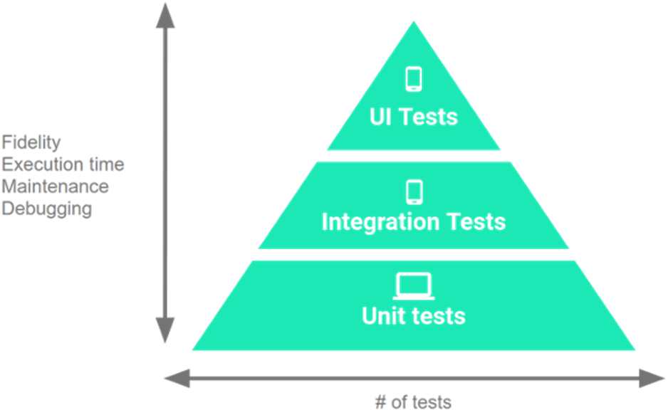
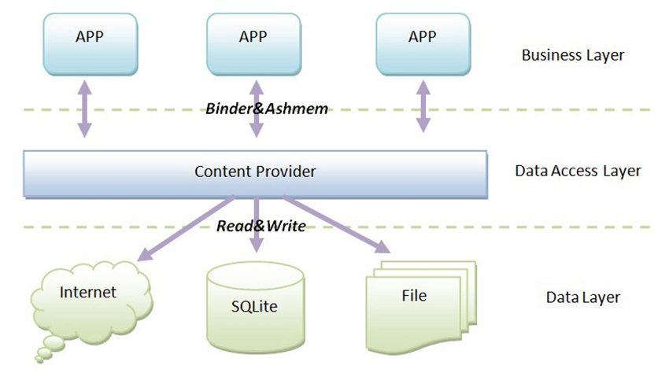
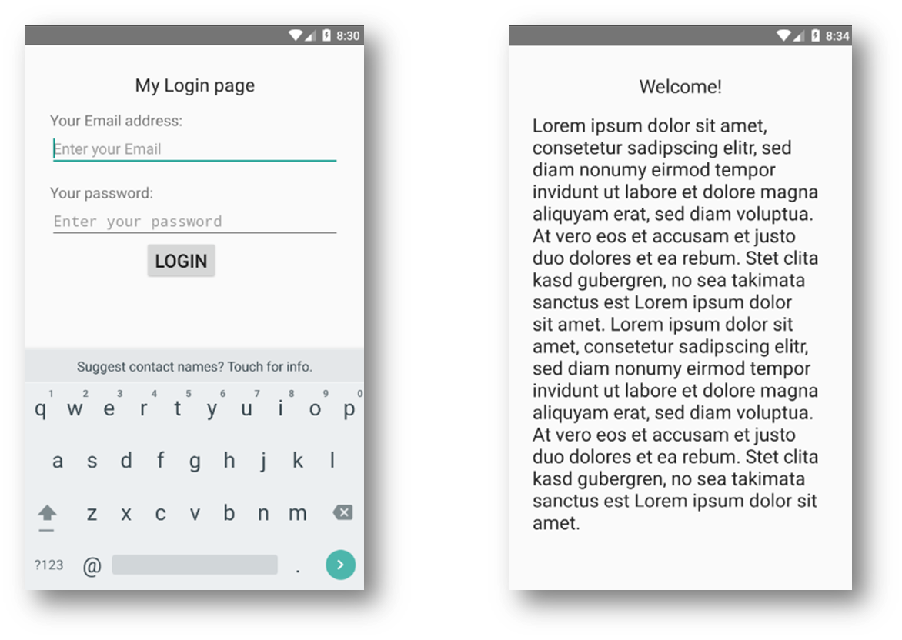
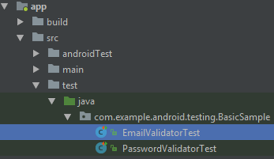
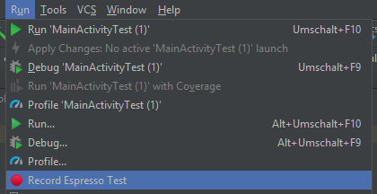

# Types of tests in Android

There are two different categories of tests in Android. Unit tests and instrumented tests, the key facts of both will be shown in the this chapter. Additionally there will be some general information about testing in Android and some frameworks which will be give you a hand in writing tests.

## General information

Following to Google the number of tests for your Android application can be build as a pyramid. The basement is build out of Unit Tests, they should make a total percentage of 70. Why? The shortest answer is they are fast\! More details will follow in the next section.

The other two testing types are spitted up in 20 percents of Integration Tests and 10 percents of UI Tests. Of course the UI is important, but for the overall testing number they make the smallest share.

Additional information can be found on the [Google Testing - Fundamentals](https://developer.android.com/training/testing/fundamentals) website.



## Unit Tests

These tests are normally used to test a single function or method. But they can be also used for test whole classes. The main reason why those test make the largest share of the testing pyramid is that they are the fastest. This comes from the fact, that Unit Tests do not need a running app. Usually there are no Android parts on which the Tests depend, and thats the point. They can run on the local JVM (Java Virtual Machine) on the development host.

Sometimes there is the need, that Unit Tests must have Android dependencies. But this would mean that they have to be run on a device and not on the JVM. Sometimes this can be bypassed with mock ups. Mock ups have the task to cover up some functionality and do like the real functions on the base.

Additional information can be found on [Unit Testing](https://developer.android.com/training/testing/unit-testing/)
website and on the [Google Testing - Local Unit Tests](https://developer.android.com/training/testing/unit-testing/local-unit-tests) website.

## Instrumented Tests

The main difference between Unit Tests and Instrumented Tests is that Instrumented Tests need a running app where they can run on. That is the reason why they are much slower than the Unit Tests. Every time a APK-File have to be build and installed on the virtual device (emulator) or the real device. But there is also a big advantage, a Instrumented Test has more access. First of all that means, that you can connect to the app context and on the other hand you can also use Android dependencies for example resources.

There are three different kinds of Instrumented Tests - Instrumented Unit Tests, Integration Tests and UI Tests.

### Instrumented Unit Tests

If Unit Tests have Android specific dependencies that can not be mocked, you can build Instrumented Unit Tests. The only difference between those Tests is, that Unit Tests are running on the JVM while Instrumented Unit Tests run on an Android device.

Additional information can be found on the [Google Testing - Instrumented Unit Tests](https://developer.android.com/training/testing/unit-testing/instrumented-unit-tests) website.

### Integration Tests

Components with those the user do not directly interact with can be tested by Integration Tests. These tests can only be run on a device, because those components could not be easily mocked up.

The most of this components are Services and Content Provider. A Service is for example a component, that is used to connect an application to the Internet and do all the communication. Content Providers are used to read and write data to the Data Layer.



As you can see in the figure Content Providers are between Business Layer and the Data Layer. The application can only communicate to the Data Layer through the Content Provider. These Tests are important to check if the applications data sharing and data saving functionality is working like it should. For instance if you would like to take a picture and save it to the phones gallery, this is a task for the Content Provider.

Additional information can be found on the [Google Testing - Integration Testing](https://developer.android.com/training/testing/integration-testing/) website.

### UI Tests

Functional UI Tests in Android can be categorized in Single app Tests and Multiple app Tests. Every time you only want to test your app with system interactions you have to make a Multiple app Test. Those tests can easily be set up with Google’s UiAutomator. It’s possible for you to simulate user and system like interactions and change the context. Also you can test multiple user apps.

If you just want to test your single app’s target. Google’s Espresso is your friend. This frameworks makes it quite easy to write user simulating UI Tests within the same context.

Additional information can be found on the [Google Testing - UI Testing](https://developer.android.com/training/testing/ui-testing/) website.

# Write Tests for sample application

## Sample App

The following sample app and some tests can be found in this [Github - Repository](https://github.com/RedTo/AndroidTesting).



The sample application for which we are going to collect test scenarios is quite simple. At the startup we will see a login screen, where the user can type in an email address and a password. Afterwards he will click on the Button with the Text ’LOGIN’.

If the login was successful, the user will be redirected to a different screen. There is much content on it and in the first line there is a text element with ’Welcome\!’ in it.

If the login failed, a error message will be displayed to the user.

Is the button pressed, there are two validation methods called. One for validating the email input and the other for validating the password input. An email address is valid if it has some characters and numbers in front of an @-symbol and a valid domain after it. The password is valid if it is longer than 8 symbols.

## Possible Unit Tests

The first tests scenarios we are going to collect, are for Unit Tests. Both before mentioned validation methods are a good point to start. As mentioned before it has to be checked that both, the email and the password input is valid. So what we have to do is just call the validation methods with different values. Some of them should be passing and some of them should fail. We should know each time what we are expecting from each test. A sample Unit Test can look like this:  

``` java
@Test
public void emailValidator_CorrectEmailSimple_ReturnsTrue() {
  assertTrue(EmailValidator.isValidEmail("name@email.com"));
}
```

In this example we would expect, that the validation method will return ’true’. If we would call the method with for  example ’mail@a.’ we would expect a returning ’false’.

As pointed out in the beginning sometimes Unit Tests depend on Android specific features or resources, therefore Mocks could be used. For instance we could think about to mock a Account validation Method, which would check online if a given Account exists. Another possible Unit Test with Mock would be to test the content delivery for the second application screen.

In the IDE the Unit Tests can be found under ’src/test/java/package\_path’.



## Possible Integration Tests

The last mentioned Unit Tests with Mocks could also be set up as Integration Tests without mocking up some stuff.

At this point the real login validation and the real content delivery methods would be tested. In this scenario we can see, that Integration Tests often depend on slow components like the Internet connection.

## Possible UI Tests

UI Tests are important to check if the screens have a high usability and are all functioning. Usually all screens would be tested with the following scenarios:

  - all components (input fields, buttons, textboxes, etc.) are visible to the user
  - input is shown in input fields like expected (for example passwords only as dots)
  - button clicking is working (redirection to other screens or success message)
  - validation is working (error messages are displayed)
  - is the app putted in the background and back in foreground the page is still the same (maybe different if required)

For an working example please have a closer look at which is all about Espresso. Additional information about UiAutomator can be found on the [Google Testing - UiAutomator](https://developer.android.com/training/testing/uiautomator) website.

In the IDE the UI Tests can be found under ’src/androidTest/java/package\_path’.


# Frameworks

## Espresso

I would highly recommend to write most of the UI Tests with Espresso. The main reason for this is, that it is integrated in the Android IDE - Android Studio.

### Test Recorder

A good way to learn how to write tests with Espresso is, to use the Test Recorder. It could be found in the IDE under Run - Record Espresso Test.



In the next step you have to select a device on which you want to record the test on. While your test is than running, you can use your app on the selected device as usual. In the background the Espresso Test Recorder will save all the clicks and inputs. All the saved user interactions are shown in the opened window. Besides user interaction you can also add assertions and check for example if some ui components are displayed as expected.

Let’s build a UI test without the recorder now:  
Assuming we want to check if on the login screen all components are shown to the user.

1.  Text ’My Login Page’ is displayed
2.  Email input field is displayed
3.  Password input field is displayed
4.  Login button is displayed

To check if those components are on the screen we first of all have to define what we are searching for. Therefor we can use ’onView’ and define some attributes to get one ViewInteraction at the end.

``` java
ViewInteraction emailInput = onView(
  allOf(
    withId(R.id.emailInput),
    isDisplayed()
  )
);
```

This code snipped is responsible to get the UI component with the id ’emailInput’ which is displayed on the screen (visible to the user).

Additionally to just search for the id, we also can check for other things, like a text.

``` java
ViewInteraction button = onView(
  allOf(
    withId(R.id.loginButton),
    withText(R.string.login),
    isDisplayed()
  )
);
```

As you can see we search our login button by, id, by text and that this component is visible to the user.

To check at least, that the search conditions are matched we have to trigger the search as follows:

``` java
emailInput.check(matches(isDisplayed()));
```

The check function could be fed by a matcher, in this case the ’isDisplayed()’ matcher. You can also check, that a ViewInteraction ’doesNotExist()’ or you can also define a own matcher if you like.

There are also other possibilities we can do with a ViewInteraction. For example to put some text in a text field. For those scenarios we would like to perform a action.

``` java
emailInput.perform(
  replaceText("valid@email.com"),
  closeSoftKeyboard()
);
```

First of all the current text of the emailInput field would be replaced by ’valid@email.com’. After that another action is performed, the close soft keyboard action, to have a clear view to the screen.

A much simpler action would be to click on the login button.

``` java
button.perform(click());
```

There a many other actions and assertions you can do with the ViewInteraction. Most of them are shown on the [Espresso Cheat Sheet](https://developer.android.com/training/testing/espresso/cheat-sheet).
If not listed there, Google is your friend. :-)

One last thing, similar to the onView there is a second ’search type’ - onData. Every time you have to wait on data or want to interact with data, it’s maybe worth to have a closer look on this.

Additional information can be found on the official [Espresso website](https://developer.android.com/training/testing/espresso).

## iOS - Frameworks

The main testing framework on iOS is [XCTest](https://developer.apple.com/documentation/xctest). This framework is maintained and recommended by Apple. Other than by Android Apple has combined many different frameworks in one. \[With XCTest you can create\] and run unit tests, performance tests, and UI tests for your XCode projects (<https://developer.apple.com/documentation/xctest>).

There are two frameworks on iOS which are very similar to Google’s Espresso for Android. The [KIF](https://github.com/kif-framework/KIF) - Framework and another Google Framework - [Earl Grey](http://google.github.io/EarlGrey/). Especially Earl Grey can be compared to Espresso, both are developed by Google and have nearly the same features. Also it is easy for developers to write Tests for both big players with a more or less identical framework syntax. 

## Appium

Based on the Selenium framework (a browser testing tool) there is appium a Client / Server architecture framework for cross plattform testing.

The heart of this framework is a webserver written in Node.js, with a REST api where the client who runs the tests can connect to. The main advantage of this architecture is, that the server and the client can run on different machines. Another positive aspect of appium is, that you can write your tests in many different languages for example C\# or PHP. So you can choose a language you are familiar with.

[Appium - Homepage](http://appium.io/)

## Mocking libraries

As mentioned in the beginning sometimes you want to mock up Android dependencies so, that you can run your tests faster. A very famous Mocking library is [Mockito](http://site.mockito.org/) it is designed for unit tests in Java. Google built his own Mocking framework especially for mock up Android dependencies. [Roboelectric](http://roboelectric.org)

This markdown file was created out of [my latex](doc/documentation.tex) file with [Pandoc](http://pandoc.org)
